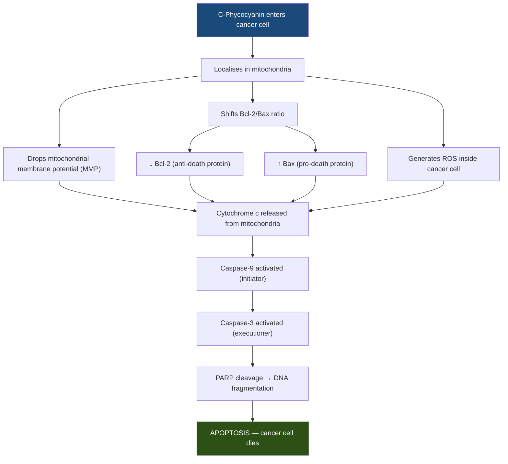
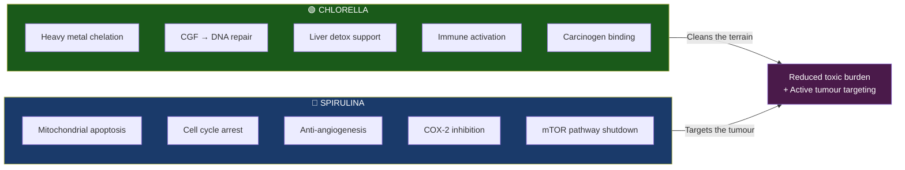

# Chlorella & Spirulina: Cancer Detox and Mitochondrial Mechanisms

> [!NOTE]
> This document compiles findings from peer-reviewed research (PubMed/NIH, MDPI, ResearchGate, AACR Journals) and expert health sources. While the evidence is compelling, most studies are *in vitro* or animal-based. **This is not medical advice** — always consult a qualified oncologist or healthcare professional.

---

## 1. Chlorella — The Body's Detoxifier

**Chlorella** is a single-celled freshwater green microalga. Its thick, fibrous cell wall and unique biochemistry make it one of the most studied natural chelators and immune modulators.

### 1.1 Heavy Metal Chelation & Detoxification

The link between heavy metals and cancer is well-established — metals like cadmium, lead, mercury, and arsenic are classified carcinogens. Chlorella's detox power comes from its **cell wall structure**:

| Mechanism | How It Works |
|---|---|
| **Cell wall binding** | Rich in carboxyl, amino, phosphoryl & hydroxyl groups that have high affinity for metal ions |
| **Intestinal chelation** | Binds metals in the GI tract, preventing reabsorption and promoting faecal excretion |
| **Organ protection** | Animal studies show reduced metal toxicity in liver, brain, and kidneys |
| **Chlorophyll content** | Chlorella is ~2–3% chlorophyll by weight — chlorophyll binds to carcinogens (aflatoxins, heterocyclic amines from cooked meat) and blocks their absorption |
| **Liver support** | Enhances Phase I and Phase II liver detox pathways, improving the body's ability to process and excrete toxins |

> [!IMPORTANT]
> Chlorella's detox relevance to cancer: By reducing the total body burden of known carcinogens (heavy metals, dioxins, PCBs), chlorella may lower the risk of **environmentally-induced cancers** and reduce ongoing toxic load during treatment.

### 1.2 Chlorella Growth Factor (CGF) & DNA Repair

CGF is a unique nucleotide-peptide complex found in chlorella's nucleus, produced during its rapid cell division:

- **Composition**: RNA, DNA, amino acids, vitamins, peptides, polysaccharides
- **DNA/RNA support**: Provides raw building blocks (nucleic acids) for the body to repair and produce its own genetic material
- **Cell repair**: Stimulates tissue regeneration and protects cells from toxic substances
- **Sun-damaged DNA**: Research suggests chlorella may act as a chemopreventive by helping repair UV-damaged DNA, potentially reducing skin cancer risk

#### CGF's Dual Role in Cancer

CGF appears to be **protective for healthy cells while hostile to cancerous ones**:

- In healthy cells → supports DNA repair, strengthens cellular integrity
- In cancer cells → hot water extracts of *Chlorella vulgaris* induce DNA damage and apoptosis in HepG2 (liver cancer) cells in a dose-dependent manner

### 1.3 Chlorella's Direct Anti-Cancer Mechanisms

| Pathway | Evidence |
|---|---|
| **Immune activation** | Stimulates T cells, B cells, NK cells, macrophages, and interferon production |
| **Apoptosis induction** | Promotes programmed cell death in liver, colon, cervical, and skin cancer lines |
| **Anti-angiogenesis** | Suppresses new blood vessel formation that tumours depend on for growth |
| **Chemo support** | Chlorella glycoprotein reduces chemotherapy side effects without compromising anti-tumour drug efficacy |
| **Antioxidant defence** | High in chlorophyll, beta-carotene, lutein — scavenges free radicals that drive mutagenesis |

---

## 2. Spirulina — Mitochondrial Targeting & Cancer Cell Reset

**Spirulina** (*Arthrospira platensis*) is a blue-green cyanobacterium. Its star compound, **C-Phycocyanin (C-PC)**, is what makes it uniquely powerful against cancer — particularly at the mitochondrial level.

### 2.1 Understanding the Warburg Effect (Why Mitochondria Matter)

To understand how spirulina helps, you need to understand what goes wrong in cancer cells:

```
HEALTHY CELL                          CANCER CELL (Warburg Effect)
─────────────                         ──────────────────────────────
Glucose → Pyruvate → Mitochondria     Glucose → Pyruvate → LACTATE
         (oxidative phosphorylation)           (aerobic glycolysis)
         = 36 ATP per glucose                  = 2 ATP per glucose
         = normal ROS signalling               = avoids apoptosis signals
                                               = feeds rapid growth
```

**The Warburg Effect**: Cancer cells *bypass* their mitochondria, fermenting glucose to lactate even when oxygen is available. This:
- Avoids mitochondrial apoptosis signals (the cell's self-destruct mechanism)
- Generates building blocks for rapid proliferation
- Creates an acidic microenvironment that suppresses immune response

> [!CAUTION]
> The core problem: Cancer cells essentially **shut down their mitochondria's kill switch**. They refuse to undergo programmed cell death. This is where spirulina's C-Phycocyanin comes in.

### 2.2 C-Phycocyanin: How It Targets Cancer Mitochondria

C-Phycocyanin can **physically penetrate cancer cell membranes and localise inside the mitochondria**. Once there, it triggers a cascade that forces cancer cells back toward apoptosis:



#### The Key Molecular Events

| Step | What Happens | Why It Matters |
|---|---|---|
| **MMP collapse** | Phycocyanin disrupts the mitochondrial membrane potential | This is the "point of no return" — once MMP drops, the cell commits to death |
| **Cytochrome c release** | Spills from mitochondria into the cytoplasm | Activates the intrinsic apoptosis cascade |
| **Bcl-2 ↓ / Bax ↑** | Shifts the survival/death protein balance | Cancer cells overexpress Bcl-2 to stay alive — phycocyanin reverses this |
| **Caspase activation** | Caspase-9 → Caspase-3 cascade | The executioner enzymes that dismantle the cell from within |
| **PARP cleavage** | DNA repair enzyme is cut, preventing repair | The cancer cell can no longer fix itself — death is irreversible |
| **ROS generation** | Reactive oxygen species flood the cancer cell | Overwhelms the cancer cell's compromised antioxidant defences |

> [!TIP]
> **The "reset" concept**: Phycocyanin essentially forces cancer cells' mitochondria to **re-engage their apoptotic machinery** — the very system the cancer cell had switched off to achieve immortality. It's not "healing" the cancer cell — it's restoring the kill switch.

### 2.3 Beyond Mitochondria: Spirulina's Full Anti-Cancer Arsenal

C-Phycocyanin attacks cancer through **multiple simultaneous pathways**:

#### Cell Cycle Arrest
- Blocks cancer cells at G0/G1 phase (stops them from dividing)
- Increases p21 expression (cell cycle brake)
- Down-regulates Cyclin E and CDK2 (cell division accelerators)
- Demonstrated in breast (MDA-MB-231), colon (HT29), and lung (A549) cancer cells

#### Autophagy Induction
- Triggers autophagic cell death by inhibiting **PI3K/Akt/mTOR** signalling
- mTOR is the master growth regulator — cancer cells hijack it for unlimited growth
- Phycocyanin shuts this pathway down

#### Anti-Metastasis & Anti-Angiogenesis
- Inhibits MMP-2 and MMP-9 (enzymes cancer uses to invade tissue)
- Binds to VEGFR1 and down-regulates VEGF-A (cuts off tumour blood supply)
- Animal studies: significantly inhibited metastasis colonies in spleen, liver, and lung

#### MAPK Pathway Modulation
- Activates p38 and JNK (stress/death signals)
- Inhibits Erk pathway (survival/growth signal)
- Net effect: tips the balance from proliferation → death

#### COX-2 Inhibition
- C-Phycocyanin inhibits cyclooxygenase-2 (COX-2)
- COX-2 overexpression is linked to many cancers (colon, breast, pancreatic)
- Chronic inflammation via COX-2 drives tumour microenvironment formation

#### Selective Toxicity
> [!IMPORTANT]
> One of the most promising aspects: Phycocyanin shows **high toxicity to cancer cells but low toxicity to normal cells**. This is the holy grail of cancer therapy — selectivity.

### 2.4 Cancer Types Studied

| Cancer Type | Cell Line | Key Findings |
|---|---|---|
| **Liver (Hepatocellular)** | HepG2 | Apoptosis via mitochondrial pathway, even in doxorubicin-resistant cells |
| **Breast** | MDA-MB-231, T47D | Cell cycle arrest at G0/G1, anti-proliferative effects |
| **Colon** | HT29, Caco-2 | Apoptosis induction, cell cycle arrest |
| **Lung** | A549 | Cell cycle arrest, anti-proliferative |
| **Ovarian** | SKOV-3 | Caspase-mediated apoptosis |
| **Cervical** | HeLa | Caspase activation, PARP cleavage |
| **Pancreatic** | — | Decreased proliferation via mitochondrial ROS inhibition |
| **Leukaemia** | — | Apoptosis induction |
| **Oral (Leukoplakia)** | Human trial | 45% complete regression after 1 year supplementation (1g/day) |

---

## 3. Chlorella + Spirulina Synergy

While no single clinical protocol defines an exact combined regimen, the two algae are **complementary**:



| Role | Chlorella | Spirulina |
|---|---|---|
| **Primary action** | Detoxification & terrain cleanup | Direct anti-tumour activity |
| **Mitochondrial effect** | Indirect — reduces oxidative stress | Direct — phycocyanin localises in mitochondria |
| **Immune support** | T cells, NK cells, interferon | Macrophages, NK cells |
| **DNA support** | CGF repairs healthy cell DNA | Damages cancer cell DNA via ROS |
| **Chemo support** | Reduces side effects, protects organs | May enhance drug efficacy, allow dose reduction |
| **Star compound** | Chlorella Growth Factor (CGF) | C-Phycocyanin (C-PC) |

### The Combined Logic

1. **Chlorella cleans the terrain** — removes heavy metals, environmental carcinogens, and toxins that fuel cancer initiation and progression
2. **Spirulina targets the tumour** — phycocyanin penetrates cancer cells, reactivates mitochondrial death pathways, arrests cell division, and cuts off blood supply
3. **Both support immunity** — enhanced NK cell and T cell activity helps the body's own surveillance system identify and destroy cancer cells
4. **Both protect during treatment** — chlorella reduces chemo toxicity on healthy tissue; spirulina's selectivity means it attacks cancer cells while sparing normal ones

---

## 4. Key Bioactive Compounds Summary

| Compound | Source | Anti-Cancer Role |
|---|---|---|
| **C-Phycocyanin** | Spirulina | Mitochondrial apoptosis, cell cycle arrest, COX-2 inhibition, anti-angiogenesis |
| **Chlorophyll** | Both (higher in Chlorella) | Carcinogen binding, antioxidant, heavy metal chelation |
| **Chlorella Growth Factor** | Chlorella | DNA repair in healthy cells, apoptosis in cancer cells |
| **Beta-carotene** | Both | Antioxidant, immune support |
| **Superoxide Dismutase (SOD)** | Spirulina | ROS neutralisation, mitochondrial protection in healthy cells |
| **Spirulinan polysaccharides** | Spirulina | Macrophage and NK cell activation |
| **Lutein** | Chlorella | Antioxidant, cellular protection |

---

## 5. Clinical Evidence & Limitations

### What We Know (Strong Evidence)
- ✅ Phycocyanin induces apoptosis in multiple cancer lines via the mitochondrial pathway
- ✅ Chlorella chelates heavy metals (cadmium, lead, mercury) in animal and some human studies
- ✅ Spirulina caused 45% complete regression of oral leukoplakia in a human trial (1g/day, 1 year)
- ✅ Phycocyanin is selectively toxic to cancer cells over normal cells
- ✅ Both enhance NK cell and T cell activity in animal and some human studies

### What Needs More Research
- ⚠️ No large-scale human RCTs specifically on chlorella/spirulina as cancer treatment
- ⚠️ Most mitochondrial mechanism studies are *in vitro* (cell cultures)
- ⚠️ Optimal dosing for anti-cancer effects in humans is not established
- ⚠️ Direct evidence of Warburg effect reversal via spirulina is not yet proven — the current evidence shows spirulina induces mitochondrial dysfunction *in cancer cells* (leading to death), rather than restoring normal mitochondrial function
- ⚠️ Bioavailability and pharmacokinetics of phycocyanin in humans need more study

> [!WARNING]
> These supplements should be considered **complementary** to conventional cancer treatment, not replacements. Always discuss with your oncology team before adding supplements, especially during chemotherapy or radiation — chlorella's chelation properties could theoretically interfere with platinum-based chemotherapy drugs (cisplatin, carboplatin).

---

## 6. Key Takeaways

1. **Chlorella is the detoxifier** — it cleans the body's internal environment by chelating heavy metals and carcinogens, supports liver detox, and provides CGF for DNA repair in healthy cells

2. **Spirulina is the mitochondrial weapon** — its C-Phycocyanin physically enters cancer cell mitochondria and forces them to re-engage their death programme (apoptosis) by collapsing membrane potential, releasing cytochrome c, and activating caspases

3. **The "cancer cell reset"** is really about **restoring apoptotic signalling** — cancer cells had switched off their mitochondrial kill switch; phycocyanin switches it back on

4. **Together, they work as terrain cleanser + tumour targeter** — chlorella reduces the toxic burden that feeds cancer, while spirulina directly attacks cancer cell survival mechanisms

5. **The selectivity is key** — phycocyanin damages cancer cells while leaving healthy cells largely unharmed, which is the most desirable property in any anti-cancer agent
---

## Key References

1. Ronga D, et al. *"[Microalgae for the food industry: health-promoting compounds and industrial applications.](https://scholar.google.com/scholar?q=chlorella+spirulina+microalgae+food+industry+health+promoting)"* Microorganisms.
2. Saini MK, Sanyal SN. *"[Phycocyanin induces apoptosis in cancer cells by targeting mitochondrial membrane potential.](https://scholar.google.com/scholar?q=phycocyanin+apoptosis+cancer+mitochondrial+membrane+potential)"* Journal of Biochemical and Molecular Toxicology.
3. Li B, et al. *"[C-phycocyanin inhibits growth and induces apoptosis of human colorectal carcinoma cells.](https://scholar.google.com/scholar?q=C-phycocyanin+inhibits+growth+apoptosis+colorectal+carcinoma)"* World Journal of Gastroenterology.
4. Kwak JH, et al. *"[Beneficial immunostimulatory effect of short-term Chlorella supplementation: enhancement of natural killer cell activity and early inflammatory response.](https://pubmed.ncbi.nlm.nih.gov/22849818/)"* Nutrition Journal. 2012;11:53.
5. Merchant RE, Andre CA. *"[A review of recent clinical trials of the nutritional supplement Chlorella pyrenoidosa in the treatment of cancer.](https://scholar.google.com/scholar?q=Chlorella+pyrenoidosa+clinical+trials+cancer+treatment+review)"* Alternative Therapies in Health and Medicine.
6. Jiang L, et al. *"[Phycocyanin: a potential drug for cancer treatment.](https://scholar.google.com/scholar?q=phycocyanin+potential+drug+cancer+treatment+selective)"* Journal of Cancer.
7. Konícková R, et al. *"[Anti-cancer effects of blue-green alga Spirulina platensis.](https://scholar.google.com/scholar?q=anti-cancer+effects+blue-green+alga+Spirulina+platensis)"* Anticancer Research.


