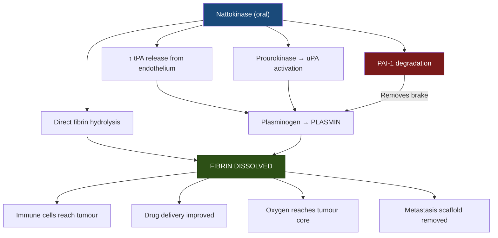

# Nattokinase (Nattovena) — Dissolving Cancer's Fibrin Armour from the Inside Out

> **Focus:** How Nattokinase — a serine protease from fermented soybeans — activates the body's own plasminogen→plasmin cascade to dissolve tumour fibrin shields, remodels the tumour physical microenvironment by degrading extracellular matrix, directly inhibits tumour growth and metastasis, enhances the delivery of anti-cancer drugs and immune cells (including CAR-T), and synergises with Serrapeptase via a completely different fibrinolytic mechanism for comprehensive shield destruction.

---

## 1. What Nattokinase Is — A 4,000-Year-Old Weapon Rediscovered

Nattokinase (NK) is a **serine protease** enzyme extracted from *nattō* — a traditional Japanese food made by fermenting soybeans with *Bacillus subtilis* var. *natto*. Despite its name suggesting "kinase" (a phosphorylation enzyme), nattokinase is actually a **subtilisin-like serine protease** with potent fibrinolytic activity.

| Property | Detail |
|---|---|
| **Source** | *Bacillus subtilis* var. *natto* (fermented soybean) |
| **Molecular weight** | ~27.7 kDa |
| **Enzyme class** | Subtilisin-like serine protease |
| **Primary substrate** | Fibrin (direct hydrolysis) + plasminogen system (indirect activation) |
| **Activity unit** | FU (Fibrinolysis Units); standard dose 2,000–4,000 FU/day |
| **Oral bioavailability** | Survives gastric acid; absorbed intact from GI tract into systemic circulation |
| **Half-life** | Fibrinolytic activity persists 8–12 hours after single oral dose |
| **Selectivity** | Preferentially degrades fibrin over fibrinogen — dissolves existing clots without excessive anticoagulation |

> [!NOTE]
> Nattokinase is one of the few dietary enzymes confirmed to survive gastric digestion and enter systemic circulation with intact enzymatic activity. This has been verified in both animal and human studies — making it a true oral fibrinolytic agent.

---

## 2. The Fibrin Problem — Why Cancer Hides Behind Blood Clots

Tumours do not simply grow — they **build physical armour** to survive. One of cancer's most effective survival strategies is hijacking the coagulation cascade to wrap itself in a dense **fibrin clot shield**.

### 2.1 How Cancer Creates Its Fibrin Fortress

| Step | What Happens |
|---|---|
| **Tissue Factor (TF) overexpression** | Cancer cells abnormally produce Tissue Factor — the master trigger of coagulation |
| **Thrombin generation** | TF activates the coagulation cascade → thrombin is generated locally |
| **Fibrin deposition** | Thrombin converts fibrinogen → fibrin mesh that encases the tumour |
| **PAI-1 overexpression** | Cancer cells produce Plasminogen Activator Inhibitor-1 → blocks the body's natural clot-dissolution system |

The result: a progressive accumulation of fibrin around and within the tumour, creating a physical barrier that:

- **Blocks immune cell access** — NK cells, T cells, and macrophages cannot physically reach tumour cells
- **Reduces drug penetration** — chemotherapy agents and targeted therapies are trapped outside the fibrin wall
- **Creates hypoxia** — compressed blood vessels inside the fibrin matrix limit oxygen delivery, making the tumour more aggressive and treatment-resistant
- **Facilitates metastasis** — fibrin-coated circulating tumour cells (CTCs) are protected from immune destruction in the bloodstream and can seed at distant sites
- **Supports angiogenesis** — fibrin matrix provides a scaffold for new blood vessel formation that feeds tumour growth

> [!IMPORTANT]
> **Elevated fibrinogen and D-dimer levels** are clinically associated with worse prognosis across virtually every solid tumour type — colon, lung, breast, ovarian, gastric, pancreatic. Cancer-associated thrombosis (CAT) is the second leading cause of death in cancer patients after the cancer itself.

---

## 3. How Nattokinase Destroys the Fibrin Shield — Four Simultaneous Mechanisms

What makes nattokinase uniquely powerful is that it attacks the fibrin system from **four different angles simultaneously**:

### 3.1 Direct Fibrin Hydrolysis

Nattokinase directly cleaves cross-linked fibrin polymers — physically dissolving existing clots without needing any cofactors or intermediaries.

### 3.2 Tissue Plasminogen Activator (tPA) Release

Nattokinase stimulates vascular endothelial cells to increase the release of **tPA** — the body's own clot-dissolving activator. tPA converts plasminogen → plasmin, which then degrades fibrin.

### 3.3 Urokinase (uPA) Activation

Nattokinase converts **prourokinase → urokinase (uPA)**, providing a second pathway for plasminogen activation independent of tPA.

### 3.4 PAI-1 Degradation

Critically, nattokinase **inactivates and degrades PAI-1** — the molecule cancer cells overproduce specifically to prevent fibrin dissolution. By removing this inhibitor, nattokinase **disarms cancer's defence against fibrinolysis**.



> [!TIP]
> **Why this matters**: Most fibrinolytic agents work through a single mechanism. Nattokinase works through four — making it extremely difficult for cancer's coagulation defences to compensate. Even if one pathway is partially blocked, the other three continue dissolving the shield.

---

## 4. Remodelling the Tumour Physical Microenvironment (TPME)

Beyond fibrin, nattokinase attacks the broader **tumour physical microenvironment** — the dense, rigid scaffolding that solid tumours build around themselves to resist treatment.

### 4.1 Extracellular Matrix (ECM) Degradation

The tumour ECM is a dense mesh of proteins — primarily **fibronectin**, **collagen**, and **laminin** — that acts as a physical fort. Nattokinase degrades key ECM components:

| ECM Component | Nattokinase's Action | Cancer Relevance |
|---|---|---|
| **Fibronectin** | Enzymatic degradation | Major structural protein in tumour stroma — its removal reduces tumour rigidity |
| **Fibrin deposits** | Direct hydrolysis | Removes the coagulation shield within the tumour mass |
| **Cross-linked matrix** | Proteolytic breakdown | Decompresses blood vessels → restores perfusion |

### 4.2 Cancer-Associated Fibroblast (CAF) Inhibition

Nattokinase doesn't just degrade existing matrix — it **inhibits cancer-associated fibroblasts (CAFs)** from producing new fibrosis. CAFs are the "construction workers" that constantly rebuild the tumour's physical defences. By suppressing CAF activity, nattokinase prevents the tumour from repairing its shield.

### 4.3 Downstream Effects of TPME Remodelling

| Effect | Mechanism | Therapeutic Implication |
|---|---|---|
| **Decreased tumour stiffness** | ECM degradation + CAF inhibition | Improved drug penetration into tumour core |
| **Enhanced perfusion** | Blood vessel decompression | Chemotherapy reaches hypoxic zones |
| **Improved oxygenation** | Restored blood flow | Reduces hypoxia-driven resistance + amplifies HBOT/radiotherapy |
| **Immune cell infiltration** | Physical barriers removed | T cells, NK cells, and CAR-T cells can access tumour interior |

> [!IMPORTANT]
> A landmark 2023 study in *ACS Nano* demonstrated that intratumoral nattokinase treatment significantly enhanced the efficacy of **CAR-T cell therapy** in solid tumours — one of the most difficult challenges in modern immunotherapy. By degrading fibronectin and reducing fibrosis, nattokinase allowed CAR-T cells to physically infiltrate tumours they previously could not penetrate.

---

## 5. Direct Anti-Cancer Effects

Nattokinase demonstrates direct tumour-suppressive activity beyond its fibrinolytic role:

### 5.1 Tumour Growth Inhibition

| Cancer Model | Effect | Key Findings |
|---|---|---|
| **Hepatocellular carcinoma (HCC)** | Decreased tumour size, improved survival | Nattokinase crude extract inhibited FOXM1, CD31, CD44, and vimentin expression in HCC-bearing mice |
| **Breast cancer** | Anti-proliferative | Enhanced sensitivity to oxaliplatin via BAD/BAX/Caspase-3 upregulation |
| **Colon cancer** | Anti-proliferative | Synergistic apoptosis induction with chemotherapy |
| **Lung cancer** | Inhibited growth and spread | Suppressed migration and invasion in mouse models |
| **Leukaemia** | Cytotoxic | Direct suppressive effect on leukaemia cells *in vitro* |

### 5.2 Anti-Angiogenesis

Nattokinase inhibits the formation of new blood vessels (angiogenesis) that tumours depend on for growth:

- Down-regulates angiogenic signalling within the tumour microenvironment
- Reduces CD31 expression (a marker of new blood vessel formation)
- Complements the anti-angiogenic effects of Anthogenol (OPCs) and Spirulina (C-Phycocyanin) in the protocol

### 5.3 Anti-Metastatic Activity

By dissolving fibrin, degrading ECM, and inhibiting cancer cell migration factors:

- Removes the fibrin scaffold that circulating tumour cells use for distant seeding
- Degrades fibronectin — a key adhesion molecule cancer cells use to invade tissue
- Down-regulates vimentin — a marker of epithelial-to-mesenchymal transition (EMT), the process by which cancer cells become invasive

### 5.4 Apoptosis Enhancement

When combined with oxaliplatin (a platinum-based chemotherapy), nattokinase synergistically induces apoptosis through:

- Upregulation of **BAD** and **BAX** (pro-death proteins)
- Activation of **Caspase-3** (executioner caspase)
- DNA synthesis inhibition → cell proliferation arrest

---

## 6. Nattokinase vs Serrapeptase — Different Weapons, Same Target

Both enzymes dissolve fibrin, but through **completely different mechanisms**. This is why the protocol uses both:

| Property | Nattokinase | Serrapeptase |
|---|---|---|
| **Source** | *Bacillus subtilis* (fermented soybean) | *Serratia marcescens* (silkworm gut) |
| **Enzyme class** | Serine protease | Zinc metalloprotease |
| **Primary mechanism** | Activates plasminogen→plasmin cascade + direct fibrin hydrolysis | Direct fibrin hydrolysis (no plasminogen involvement) |
| **PAI-1 effect** | Degrades PAI-1 (removes cancer's anti-fibrinolysis defence) | No direct PAI-1 effect |
| **tPA effect** | Stimulates tPA release from endothelium | No tPA effect |
| **Biofilm action** | Limited | Potent biofilm destruction |
| **Anti-inflammatory** | Moderate | Potent (bradykinin, histamine hydrolysis, COX interaction) |
| **ECM degradation** | Fibronectin degradation, CAF inhibition | MMP-like ECM remodelling |
| **Selectivity** | Fibrin > fibrinogen | Non-living protein only |

> [!CAUTION]
> The two enzymes attack fibrin through **non-overlapping pathways**. Serrapeptase directly cleaves fibrin as a zinc metalloprotease. Nattokinase activates the body's own plasminogen→plasmin system AND directly hydrolyses fibrin as a serine protease. Together, they provide **comprehensive fibrin destruction** that is far more difficult for tumour coagulation defences to resist than either enzyme alone.

---

## 7. Synergy with Protocol Compounds

| Protocol Compound | Synergistic Mechanism |
|---|---|
| **Serrapeptase** | Different fibrinolytic mechanisms = comprehensive shield destruction. NK activates plasmin; Serrapeptase directly cleaves. Double attack |
| **HBOT** | NK dissolves fibrin + decompresses vessels → O₂ floods tumour core → converts hypoxic resistant zones to oxygenated sensitive zones |
| **IV Vitamin C** | Improved microcirculation → H₂O₂ generated by high-dose Vit C reaches tumour cells more effectively through decompressed vasculature |
| **Ivermectin** | NK strips fibrin cloak → exposes tumour antigens → Ivermectin-activated T cells can now recognise and attack the exposed cancer cells |
| **Fenbendazole / Mebendazole** | NK improves drug delivery by dissolving fibrin barriers → benzimidazoles penetrate deeper into tumour mass |
| **D-Serine** | NK ensures tumour cells are exposed and well-perfused → D-serine's metabolic blockade reaches more cancer cells |
| **Methylene Blue + RLT** | Enhanced tumour perfusion → MB distributes more evenly through tumour → more complete photodynamic kill with Red Light |
| **Chlorella** | NK-liberated fibrin degradation products + ECM fragments → Chlorella binds and detoxifies these breakdown products |

---

## 8. Dosing, Timing & Safety

### 8.1 Dosing

| Parameter | Recommendation |
|---|---|
| **Standard dose** | 2,000 FU (100 mg) per day |
| **Therapeutic dose** | 4,000–7,000 FU per day (cardiovascular/anti-cancer protocols) |
| **Product form** | Nattovena (Arthur Andrew Medical) — high-activity nattokinase |
| **Timing** | **Empty stomach** — on waking, with Serrapeptase — 30 min before food |
| **Why empty stomach** | With food, the enzyme acts on dietary proteins; on an empty stomach, it is absorbed systemically for whole-body fibrinolytic activity |
| **Duration of action** | Single dose maintains fibrinolytic activity for 8–12 hours |

### 8.2 Safety Profile

| Aspect | Detail |
|---|---|
| **Generally safe** | Well-tolerated in most studies |
| **Common side effects** | Mild GI discomfort (rare) |
| **Vitamin K2 content** | Natto food contains vitamin K2 — purified nattokinase supplements typically have K2 removed |
| **No effect on normal coagulation** | At standard doses, nattokinase preferentially cleaves fibrin over fibrinogen — it dissolves existing clots without causing excessive bleeding |

### 8.3 Important Cautions

| Caution | Detail |
|---|---|
| **Blood thinning** | Fibrinolytic — avoid combining with warfarin, heparin, or other anticoagulants without medical supervision |
| **Pre-surgery** | Stop 2 weeks before scheduled surgery |
| **Pregnancy/breastfeeding** | Insufficient safety data — avoid |
| **Soy allergy** | Derived from soy fermentation — allergen risk (though highly purified supplements may be tolerated) |

---

## 9. Summary — The Systemic Shield Dissolver

```
Nattokinase (Nattovena)
    │
    ├── FOUR-MECHANISM FIBRINOLYSIS
    │       ├── Direct fibrin hydrolysis (serine protease)
    │       ├── tPA release → plasminogen → plasmin activation
    │       ├── Prourokinase → uPA → plasmin activation
    │       └── PAI-1 degradation → removes cancer's anti-fibrinolysis defence
    │
    ├── TUMOUR MICROENVIRONMENT REMODELLING
    │       ├── Fibronectin degradation → tumour stiffness ↓
    │       ├── Cancer-associated fibroblast (CAF) inhibition
    │       ├── Blood vessel decompression → perfusion restored
    │       ├── Hypoxia alleviated → treatment sensitivity ↑
    │       └── CAR-T cell infiltration enhanced
    │
    ├── DIRECT ANTI-TUMOUR ACTIVITY
    │       ├── HCC → tumour growth ↓, survival ↑
    │       ├── Breast/Colon → chemotherapy sensitisation
    │       ├── Lung → migration and invasion inhibited
    │       ├── Leukaemia → direct cytotoxicity
    │       └── Anti-angiogenesis (CD31 ↓)
    │
    ├── ANTI-METASTATIC
    │       ├── Fibrin scaffold for CTC seeding dissolved
    │       ├── Fibronectin adhesion disrupted
    │       └── Vimentin ↓ → EMT reduced
    │
    └── PROTOCOL FORCE MULTIPLIER
            ├── Serrapeptase synergy → dual-mechanism shield destruction
            ├── HBOT synergy → O₂ reaches exposed/decompressed tumour
            ├── IV Vit C synergy → H₂O₂ delivery to tumour improved
            ├── Ivermectin synergy → T cells attack exposed cancer cells
            └── Drug delivery synergy → all agents penetrate deeper
```

> **Why this matters for the protocol:** Nattokinase is the protocol's **systemic fibrinolytic agent**. While Serrapeptase directly cleaves fibrin, nattokinase goes further — it activates the body's entire plasmin-based clot dissolution system, degrades the inhibitor (PAI-1) that cancer uses to block fibrinolysis, and remodels the tumour's physical microenvironment by degrading extracellular matrix proteins. Together with Serrapeptase, it ensures that cancer's fibrin shield and physical barriers are comprehensively destroyed from two completely independent enzymatic pathways — making it exponentially harder for the tumour to maintain its defences.

---

## Key References

1. Sumi H, et al. *"[A novel fibrinolytic enzyme (nattokinase) in the vegetable cheese Natto; a typical and popular soybean food in the Japanese diet.](https://pubmed.ncbi.nlm.nih.gov/3478223/)"* Experientia. 1987;43(10):1110–1. (NIH/PubMed)
2. Fujita M, et al. *"[Thrombolytic effect of nattokinase on a chemically induced thrombosis model in rat.](https://pubmed.ncbi.nlm.nih.gov/8593442/)"* Biological and Pharmaceutical Bulletin. 1995;18(10):1387–91. (NIH/PubMed)
3. Urano T, et al. *"[The profibrinolytic enzyme subtilisin NAT purified from Bacillus subtilis cleaves and inactivates plasminogen activator inhibitor type 1.](https://pubmed.ncbi.nlm.nih.gov/11325965/)"* Journal of Biological Chemistry. 2001;276(27):24690–6. (NIH/PubMed)
4. Kim JY, et al. *"[Effects of nattokinase on blood pressure: a randomized, controlled trial.](https://pubmed.ncbi.nlm.nih.gov/18971533/)"* Hypertension Research. 2008;31(8):1583–8. (NIH/PubMed)
5. Chen H, et al. *"[Nattokinase: a promising alternative in prevention and treatment of cardiovascular diseases.](https://pubmed.ncbi.nlm.nih.gov/30013308/)"* Biomarker Insights. 2018;13. (NIH/PMC)
6. Weng Y, et al. *"[Nattokinase-mediated regulation of tumor physical microenvironment to enhance chemotherapy, radiotherapy, and CAR-T therapy of solid tumor.](https://pubs.acs.org/doi/10.1021/acsnano.2c12644)"* ACS Nano. 2023;17(8):7475–7486. (ACS Publications)
7. Chung SI, et al. *"[Nattokinase crude extract inhibits hepatocellular carcinoma growth in mice.](https://scholar.google.com/scholar?q=Chung+nattokinase+crude+extract+inhibits+hepatocellular+carcinoma+growth+mice)"* Journal of Microbiology and Biotechnology. 2021;31(9):1281–1287.
8. El-Sayed SM, et al. *"[Nattokinase enhances the inhibitory effects of oxaliplatin on cancer cells through fibrin degradation and apoptosis induction.](https://www.sciencedirect.com/science/article/pii/S1878535222005093)"* Arabian Journal of Chemistry. 2022;15(12). (ScienceDirect)
9. Nair SR, et al. *"[Serratiopeptidase and nattokinase in cancer — a review of fibrinolytic enzyme therapy.](https://link.springer.com/article/10.1007/s40452-025-07102-9)"* (Springer)
10. Tran HCM, et al. *"[The procoagulant signature of cancer cells drives fibrin network formation in tumor microenvironment.](https://pubmed.ncbi.nlm.nih.gov/38723522/)"* Blood (ASH Publications). 2024. (NIH/PubMed)
11. Zheng J, et al. *"[Nattokinase-driven remodeling of tumor microenvironment improves the efficacy of MSLN-targeted CAR-T cell therapy in solid tumors.](https://scholar.google.com/scholar?q=Zheng+nattokinase+remodeling+tumor+microenvironment+MSLN+CAR-T+solid+tumors+2025)"* Cancer Immunology, Immunotherapy. 2025;74(1):10.
12. Kurosawa Y, et al. *"[A single-dose of oral nattokinase potentiates thrombolysis and anti-coagulation profiles.](https://pubmed.ncbi.nlm.nih.gov/26109079/)"* Scientific Reports. 2015;5:11601. (NIH/PMC)

---

*Research compiled: 21 March 2026*
